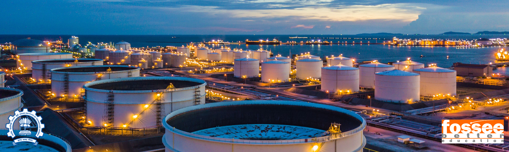

# CRUDE OIL CHARACTERISATION & PRODUCTS PROPERTIES ESTIMATION

[](https://python.org)
[](https://scikit-learn.org)
[](https://xgboost.readthedocs.io/)
[](https://tensorflow.org/)
[](https://keras.io/)

## Project Overview
This project develops **Machine Learning and ANN surrogate models** to predict critical crude oil quality parameters directly from readily available physical measurements, bypassing time-consuming laboratory assays. Using a dataset of 114 crude oil blend assays, the models learn complex non-linear relationships between physical properties and:
- **Set 1 — Hydrocarbon Composition**: Aromatics, Naphthenes, and Paraffins (% by weight)
- **Set 2 — Kinematic Viscosity**: cSt at 37.78°C (100°F) and 98.89°C (210°F)
- **Set 3 — Secondary Quality Specifications**: Cetane Number, Bromine Number, Aniline Point, Freeze Point, Pour Point, Cloud Point, Total Acid Number, and C:H Ratio

Traditional laboratory methods (ASTM assays) require 4–8 hours per sample, with large sample volumes and hazardous reagents. The surrogate models developed here provide near-instant predictions, enabling real-time Crude Distillation Unit (CDU) optimization and reduced operational risk.

> **Context**: This project was completed during **FOSSEE Semester Long Internship (Autumn 2025), IIT Bombay**

## Literature Foundation
- **Crude Oil Characterisation & Products Properties Estimation using Artificial Neural Network** *(Thesis)* - By Jhuma Sadhukhan (1997)
- **Application of artificial neural network for prediction of 10 crude oil properties** *(Research Paper)* - Alizadeh et al. (2023)
  
## Dataset Information
- **Source**: Custom python script used to extract data from 114 Crude Oil Assays (csv)
- **Size**: 114 records × 26 features
- **Inputs**: 13 standardized features

### 1. Input Features (Independent Variables):

| Category | Feature | Unit | Description |
|----------|---------|------|-------------|
| **Bulk Properties** | `StdLiquidDensity (kg/m3)` | kg/m³ | Standard Liquid Density |
| | `SulphurByWt (%)` | wt% | Total Sulfur Content |
| | `ConradsonCarbonByWt (%)` | wt% | Carbon residue after evaporation/pyrolysis |
| | `NitrogenByWt (%)` | wt% | Total Nitrogen Content |
| **Distillation Profile (Boiling Points)** | `Distillation Mass @ X Pct (C)@ 1 (%) - TBP` | °C | True boiling point at 1% cut |
| | `Distillation Mass @ X Pct (C)@ 5 (%) - TBP` | °C | True boiling point at 5% cut |
| | `Distillation Mass @ X Pct (C)@ 10 (%) - TBP` | °C | True boiling point at 10% cut |
| | `Distillation Mass @ X Pct (C)@ 30 (%) - TBP` | °C | True boiling point at 30% cut |
| | `Distillation Mass @ X Pct (C)@ 50 (%) - TBP` | °C | True boiling point at 50% cut |
| | `Distillation Mass @ X Pct (C)@ 70 (%) - TBP` | °C | True boiling point at 70% cut |
| | `Distillation Mass @ X Pct (C)@ 90 (%) - TBP` | °C | True boiling point at 90% cut |
| | `Distillation Mass @ X Pct (C)@ 95 (%) - TBP` | °C | True boiling point at 95% cut |
| | `Distillation Mass @ X Pct (C)@ 99 (%) - TBP` | °C | True boiling point at 99% cut |

### 2. Output Variables (Target Sets):

#### Set 1: Hydrocarbon Composition - PNA Analysis
| Variable | Description | Unit |
|----------|-------------|------|
| `AromByWt` | Aromatics content | % by weight |
| `NaphthenesByWt` | Naphthenes content | % by weight |
| `ParaffinsByWt` | Paraffins content | % by weight |

#### Set 2: Kinematic Viscosity
| Variable | Description | Unit |
|----------|-----------|------|
| `KinematicViscosity (cSt)@ 37.78 (C)` | Kinematic Viscosity at 37.78°C | cSt |
| `KinematicViscosity (cSt)@ 98.89 (C)` | Kinematic Viscosity at 98.89°C | cSt |

#### Set 3: Secondary Quality Specifications
| Variable | Description | Unit |
|----------|-------------|------|
| `CetaneNumber` | Ignition quality indicator for diesel fractions | Unitless |
| `BromineNumber` | Ignition quality indicator for diesel fractions | g Br2/100g |
| `AnilinePoint` | Indicator of aromatic content | °C |
| `FreezePoint` | Lowest temp before hydrocarbon crystals form | °C |
| `PourPoint` | Lowest temp at which oil remains fluid | °C |
| `CloudPoint` | Temperature at which wax crystals first appear | °C |
| `TotalAcidNumber` | Measure of acidity/corrosivity (naphthenic acid) | mg KOH/g |
| `CtoHRatioByWt` | Carbon-to-Hydrogen weight ratio (energy density) | Ratio |

> **Note**: `BromineNumber` was dropped from the dataset due to 100% missing values.

## Model Workflow
This project follows a structured machine learning pipeline across three independent prediction tasks.

1. **Data Extraction**
   - The raw data was stored across 114 individual Excel assay files. A custom extraction script (`DataExtraction.ipynb`) was developed to automate data collection
   - Consolidate all records into a single `Extracted_CrudeData.csv`

2. **Data Preprocessing & EDA** (`ExploratoryDataAnalysis.ipynb`)
   - Drop `BromineNumber` column (100% missing values)
   - Coerce `KinematicViscosity` columns from object to numeric
   - Validate non-negative constraints, TBP monotonicity, and PNA composition sums
   - Perform univariate analysis: histograms with KDE, boxplots, violin plots, TBP curve overlays, and QQ plots
   - Conduct bivariate analysis: scatter plots of all inputs vs. each target set
   - Generate stacked bar charts for crude composition comparison
   - Produce full pairplots and correlation heatmaps for multivariate relationships

3. **Feature Engineering** (applied in all three model notebooks)
   - Apply `StandardScaler` to all 13 numerical input features
   - For ANN models: apply PCA (95% variance explained) before feeding to the network
   - Train/test split: 80/20 with `random_state=42`

4. **Model Training & Selection** (three separate notebooks: Set 1, 2, 3)
   - Train multiple classical ML regressors using `MultiOutputRegressor` wrappers via `sklearn.Pipeline`
   - Train a custom Artificial Neural Network (ANN) using Keras/TensorFlow
   - ANN training uses Early Stopping and TensorBoard logging
   - Evaluate all models using R², MAE, and RMSE on the test set
   - Select best-performing model per target set

5. **Model Diagnostics**
   - Compare all model rankings by R² on test set
   - ANN training/validation loss curves monitored for overfitting
   - Sample prediction outputs verified against ground truth
     
## Performance Metrics

### Set 1 — Hydrocarbon Composition (AromWt%, NaphWt%, ParaWt%)

| Model | R² | MAE (%) | RMSE (%) |
|-------|----|---------|---------|
| Support Vector Regression | **0.745** | 6.63 | 8.74 |
| XGBoost | 0.597 | 8.15 | 10.01 |
| Random Forest | 0.591 | 8.62 | 10.72 |
| Gradient Boosting | 0.565 | 8.44 | 10.86 |
| Elastic Net Regression | 0.507 | 9.62 | 12.22 |
| Linear Regression | 0.482 | 9.28 | 12.16 |
| K-Nearest Neighbours | 0.481 | 9.46 | 12.55 |
| PLS Regression | 0.462 | 9.40 | 12.30 |
| Ridge Regression | 0.433 | 9.77 | 12.49 |
| Decision Tree Regression | 0.293 | 9.91 | 14.52 |
| ANN (64→32→3, PCA) | 0.648 | 8.10 | 10.38 |

> **Best Model:** Support Vector Regression (R² = 0.745)

---

### Set 2 — Kinematic Viscosity (KV @ 37.78°C and 98.89°C)

| Model | R² | MAE | RMSE |
|-------|----|-----|------|
| **XGBoost** | **0.912** | 0.289 | 0.412 |
| Linear Regression | 0.880 | 0.362 | 0.511 |
| AdaBoost | 0.867 | 0.400 | 0.558 |
| K-Nearest Neighbours | 0.865 | 0.350 | 0.531 |
| Random Forest | 0.863 | 0.351 | 0.534 |
| Ridge Regression | 0.863 | 0.379 | 0.558 |
| Extra Trees Regressor | 0.858 | 0.334 | 0.564 |
| SVR | 0.857 | 0.437 | 0.619 |
| Gradient Boosting | 0.821 | 0.376 | 0.639 |
| Decision Tree Regressor | 0.779 | 0.454 | 0.614 |
| ElasticNet | 0.757 | 0.577 | 0.701 |
| Lasso Regression | 0.403 | 0.831 | 0.986 |
| ANN (64→Dropout→32→2) | 0.64 | — | — |

> **Best Model:** XGBoost Regressor (R² = 0.912)
> Note: Log-transformed viscosity targets used for ANN training due to extreme positive skew.

---

### Set 3 — Secondary Quality Specifications (7 targets)

| Model | Test R² | Test MAE | Test RMSE |
|-------|---------|---------|---------|
| AdaBoost | 0.311 | 10.52 | 19.34 |
| XGBoost | 0.268 | 11.01 | 20.31 |
| Extra Tree Regression | 0.258 | 10.92 | 20.77 |
| Elastic Net Regression | 0.246 | 10.75 | 20.43 |
| Random Forest | 0.222 | 10.59 | 20.05 |
| K-Nearest Neighbours | 0.182 | 11.56 | 21.27 |
| Gradient Boosting | 0.170 | 11.24 | 21.68 |
| Lasso Regression | 0.158 | 10.99 | 20.58 |
| SVR | 0.121 | 9.74 | 19.16 |
| PLS Regression | 0.027 | 10.86 | 20.45 |
| ANN (128→64→32→16→7, PCA, BatchNorm) | 0.232 | 11.53 | 21.15 |

> **Best Model:** AdaBoost Regressor (R² = 0.311)
> Set 3 is the most challenging target set due to the diverse nature of 7 multi-physics outputs. Lower R² values reflect the fundamental difficulty of predicting these properties from bulk crude features alone.

## Project Structure
```text
CrudeCharacterization/
├── README.md                           # Project documentation
├── requirements.txt                    # Python dependencies
├── setup.py                            # Package setup
├── .gitignore
│
├── notebook/                           # Jupyter notebooks
│   ├── ExploratoryDataAnalysis.ipynb   # EDA, data cleaning & visualization
│   ├── SET1 Model Training.ipynb       # ML + ANN models for Hydrocarbon Composition
│   ├── SET2 Model Training.ipynb       # ML + ANN models for Kinematic Viscosity
│   ├── SET3 Model Training.ipynb       # ML + ANN models for Secondary Quality Specs
│   │
│   ├── dataset/
│   │   ├── Extracted_CrudeData.csv     # Consolidated extracted dataset (114 crudes)
│   │   └── DataExtraction.ipynb        # Data extraction script from 114 Excel assay files
│   │
│   └── logs/                           # TensorBoard training logs
│
├── src/                                # Source code modules
│   └── __init__.py
│
└── Project Report.docx                 # Detailed technical report
```

## Key Technologies & Libraries

- **Data Extraction & Processing:** Pandas, NumPy, StandardScaler
- **Machine Learning:** Scikit-learn (Linear Regression, Ridge, Lasso, ElasticNet, SVR, KNN, Decision Tree, Random Forest, Gradient Boosting, AdaBoost, Extra Trees, PLS Regression), XGBoost
- **Deep Learning:** TensorFlow, Keras (Sequential API, Dense, Dropout, BatchNormalization, EarlyStopping)
- **Dimensionality Reduction:** PCA (sklearn)
- **Visualization:** Matplotlib, Seaborn
- **Model Evaluation:** R² Score, MAE, RMSE

## Installation

### Prerequisites

- Python 3.8 or higher
- pip package manager

### Local Setup

- Clone the repository
```bash
git clone https://github.com/yourusername/Crude-Oil-Characterization.git
cd Crude-Oil-Characterization
```

- Create virtual environment
```bash
python -m venv venv
source venv/bin/activate   # Windows: venv\Scripts\activate
```

- Install dependencies
```bash
pip install -r requirements.txt
```

- Launch Jupyter Notebook
```bash
jupyter notebook
```

- Navigate to notebooks
  - Open `DataExtraction.ipynb` to regenerate the dataset from raw Excel assay files
  - Open `ExploratoryDataAnalysis.ipynb` for data cleaning and visualization
  - Open `SET1ModelTraining.ipynb`, `SET2ModelTraining.ipynb`, or `SET3ModelTraining.ipynb` for model training and evaluation

## Acknowledgments
- FOSSEE, IIT Bombay under Prof. Prabhu Ramachandran and mentor Priyam Nayak


